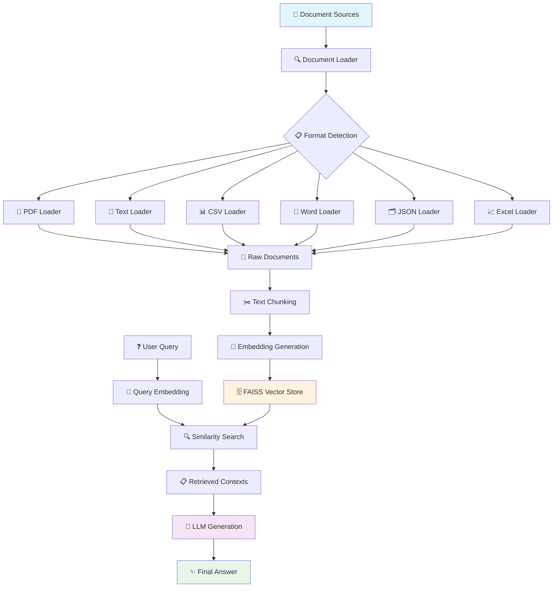

# 🚀 Production RAG Pipeline with LangChain & FAISS

A complete, production-ready Retrieval-Augmented Generation (RAG) system built with modular Python architecture. This project demonstrates how to build a scalable document processing and intelligent question-answering system using modern AI tools.

## 🎯 Project Overview

This RAG pipeline provides:

- **Multi-format document processing** (PDF, TXT, CSV, Excel, Word, JSON)
- **Intelligent document chunking** with overlap for better context preservation
- **FAISS vector database** for efficient similarity search and persistence
- **Sentence Transformers** for high-quality embeddings
- **Groq LLM integration** for fast, accurate text generation
- **Modular architecture** with separate components for easy maintenance and scaling

## ✨ Key Features

### 🔄 **Complete RAG Workflow**

- **Document Ingestion**: Automatic loading of multiple file formats
- **Text Processing**: Smart chunking with configurable size and overlap
- **Vector Storage**: FAISS-based vector database with persistence
- **Semantic Search**: Similarity search with configurable top-k results
- **LLM Generation**: Context-aware response generation with Groq

### 🏗️ **Production Architecture**

- **Modular Design**: Separate components for data loading, embedding, vector storage, and search
- **Persistent Storage**: FAISS index and metadata saved to disk
- **Error Handling**: Comprehensive error handling across all components
- **Configurable Parameters**: Easy customization of chunk sizes, models, and search parameters
- **Environment Management**: UV-based dependency management

### 📚 **Multi-Format Support**

- **PDF Documents**: Using PyPDF and PyMuPDF loaders
- **Text Files**: Plain text document processing
- **Structured Data**: CSV, Excel, and JSON file support
- **Word Documents**: DOCX file processing
- **Metadata Preservation**: Source tracking and document metadata

## � Supported Document Types

| Document Type  | Extensions      | Loader Used               | Description                                    | Use Cases                                    |
| -------------- | --------------- | ------------------------- | ---------------------------------------------- | -------------------------------------------- |
| **PDF**        | `.pdf`          | `PyPDFLoader`             | Extracts text from PDF documents with metadata | Research papers, reports, manuals, books     |
| **Plain Text** | `.txt`          | `TextLoader`              | Direct text file processing                    | Code files, logs, documentation, notes       |
| **CSV**        | `.csv`          | `CSVLoader`               | Structured data with column headers            | Data exports, spreadsheets, databases        |
| **Excel**      | `.xlsx`, `.xls` | `UnstructuredExcelLoader` | Excel workbooks and spreadsheets               | Financial data, reports, structured datasets |
| **Word**       | `.docx`         | `Docx2txtLoader`          | Microsoft Word documents                       | Business documents, reports, articles        |
| **JSON**       | `.json`         | `JSONLoader`              | Structured JSON data                           | API responses, configuration files, datasets |

### **Document Processing Features**

- ✅ **Automatic Format Detection**: Based on file extensions
- ✅ **Metadata Extraction**: Source file, page numbers, timestamps
- ✅ **Error Handling**: Graceful handling of corrupted or unsupported files
- ✅ **Batch Processing**: Process entire directories at once
- ✅ **Content Validation**: Ensures non-empty content before processing
- ✅ **Encoding Support**: UTF-8 and various character encodings

## 🔄 RAG Pipeline Flow

